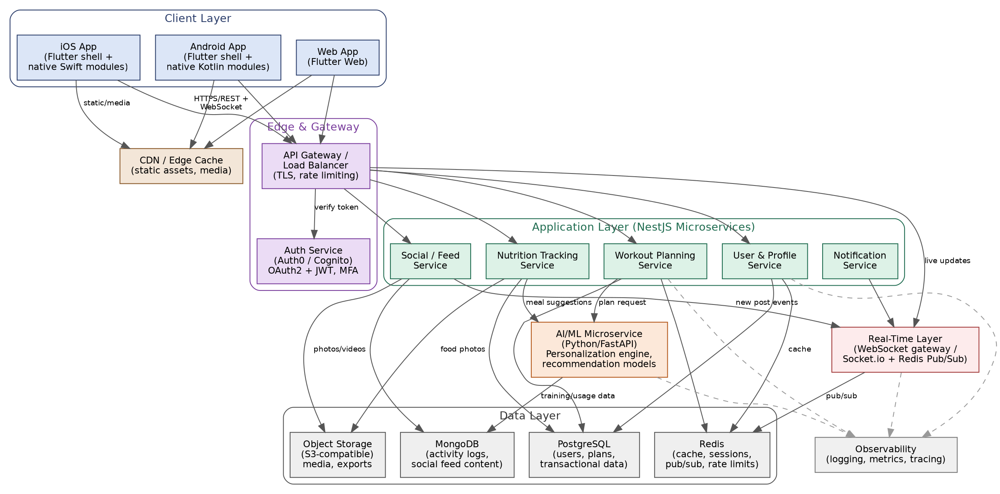

# ADR-001: Adopt a Flutter-first, microservices-based architecture for the FitFlow redesign

## Status
Accepted

## Context
FitFlow requires a seamless iOS/Android/Web experience, high performance, personalized AI-driven recommendations, real-time social features, and secure handling of health data, to be delivered and maintained by a mid-sized team.

## Decision
- Use Flutter as the single cross-platform UI framework for iOS, Android, and Web, with native Swift/Kotlin modules limited to HealthKit/Health Connect integration.
- Decompose the backend into independently deployable NestJS microservices by business capability (User, Workout, Nutrition, Social, Notification), plus a dedicated FastAPI AI/ML microservice.
- Use PostgreSQL as the system of record for sensitive/transactional data and MongoDB for high-volume, loosely structured feed/log data.
- Use Auth0 for authentication/authorization to remain cloud-agnostic and reduce identity-security engineering effort.
- Introduce a Redis-backed real-time layer to support live social feed updates and notifications.

## Consequences
**Positive:** single frontend codebase reduces time-to-market and cost; microservices allow independent scaling and deployment; clear separation of the AI workload lets it evolve independently; PostgreSQL + Auth0 give a strong compliance foundation.

**Negative:** microservices introduce operational complexity (service discovery, distributed tracing, inter-service auth) that a mid-sized team must manage; running two databases increases operational overhead versus a single database; Flutter's smaller (though healthy) plugin ecosystem may occasionally require custom native modules.

## Alternatives Considered
- **React Native + monolithic NestJS backend:** rejected due to weaker native web support and reduced scalability of a single monolith as feature scope grows.
- **Kotlin Multiplatform + Swift native UI:** rejected because it does not address the Web requirement and roughly doubles UI development effort.